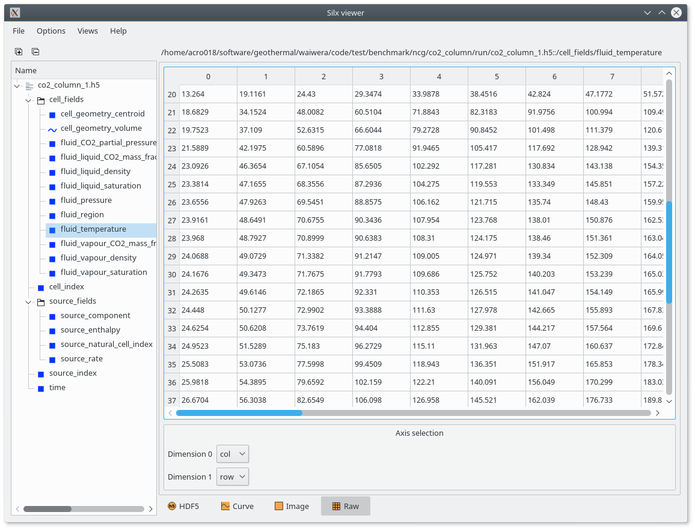

.. _output:

***************************
Working with Waiwera output
***************************

Waiwera's main simulation results are output to an HDF5 file, which may be configured via the JSON input file (see :ref:`setup_output`).

.. index:: HDF5; viewers, output; viewing

Viewing simulation output
=========================

Various software tools are available for viewing the groups and datasets in HDF5 files. The simplest is ``h5dump``, a command-line tool which can dump an ASCII representation of the HDF5 file's contents to the console.

There are also graphical tools for viewing HDF5 files, for example `HDFView <https://portal.hdfgroup.org/display/HDF5/Learning+HDF5+with+HDFView>`_, `Silx <https://pypi.org/project/silx/>`_ (see :numref:`silx_fig`) and others. These tools typically also include features for producing simple plots of the datasets.

.. _silx_fig:

           Viewing a Waiwera HDF5 output file with Silx viewer

.. index:: output; structure, HDF5; structure

How simulation output is structured
===================================

Data in HDF5 files are generally organised into **groups**, which may be considered analogous to directories in a file system. A group may contain one or more **datasets**. All the groups and datasets in an HDF5 file are contained in a top-level group called the "root" group. For more information on the HDF5 data model, refer to the `HDF5 documentation <https://portal.hdfgroup.org/display/HDF5/HDF5>`_.

Under the root group, a Waiwera HDF5 output file contains two groups, "cell_fields" and "source_fields".

.. index:: output; cells, HDF5; cell_fields group

Output at cells
---------------

The **"cell_fields"** group in a Waiwera HDF5 output file contains output data defined at the cells. The main datasets in this group contain the **fluid properties** computed in the cells. These datasets have names beginning with "fluid\_" (e.g. "fluid_liquid_density"). The specific fluid datasets included here can be selected in the Waiwera JSON input file (see :ref:`output_fluid_fields`).

Because the fluid datasets are generally time-dependent, there is one row in the dataset for each output time (see :ref:`time_output`), and on each row there is one column per cell.

The "cell_fields" group also contains datasets related to **cell geometry**, which have names beginning with "cell_geometry". For example, the "cell_geometry_volume" dataset contains the volumes of all the cells. These datasets are not time-dependent, so there is just one row per cell. The "cell_geometry_centroid" dataset contains a three-element array for each cell, so there are three columns on each row.

.. index:: output; sources, HDF5; source_fields group

Output at sources
-----------------

The **"source_fields"** group in a Waiwera HDF5 output file contains output data defined at the sources (see :ref:`source_terms`), for example the flow rate and enthalpy at each source. These datasets have names beginning with "source\_", e.g. "source_rate". The datasets included here can be selected in the Waiwera JSON input file (see :ref:`output_source_fields`).

Like the fluid datasets, most of the source datasets are time-dependent, having one row per output time, with each row having one column per source.

.. index:: output; time, HDF5; time
.. _time_output:

Output time dataset
-------------------

The root group in a Waiwera HDF5 output file also contains a **"time"** dataset. This is a simple array containing all the output times, one per row.

.. index:: output; ordering, HDF5; ordering, output; index datasets, HDF5; index datasets
.. _index_datasets:

Index datasets and data ordering
--------------------------------

When PETSc writes cell data from a parallel simulation to HDF5 output, by default the data are not written in the original or "natural" ordering that would occur in a serial simulation. This is because in a parallel simulation, the mesh is distributed amongst the different parallel processes, and re-assembling the distributed data back into its natural ordering would require a parallel "scattering" operation every time data were to be output. Operations requiring parallel communication need to be kept to a minimum if the code is to scale well to large numbers of parallel processes.

Instead, data are written out in what is known as "global" ordering. Here, the data are written in process order, so all the data from parallel process 0 are written first, followed by all the data from process 1, and so on. On each process, the data are written out according to a "local" ordering on that process, which is generally not related to the natural ordering.

As an example, consider the simple 9-cell 2-D mesh in :numref:`global_ordering_fig`, and a possible partition of it amongst two parallel processes. In a serial simulation, cell data would simply be written out in the natural ordering, [0, 1, 2, ... 8]. After the parallel partitioning, however, the natural indices corresponding to the local ordering on process 0 are [3, 6, 7, 8], and those on process 1 are [0, 1, 2, 4, 5]. Hence when cell data over the whole mesh are written out in parallel, the natural indices corresponding to the global output ordering are [3, 6, 7, 8, 0, 1, 2, 4, 5].

.. _global_ordering_fig:
.. figure:: global_ordering.*
           :scale: 67 %
           :align: center

           Natural and local cell ordering

The Waiwera HDF5 output file contains a dataset (in the root group) called **"cell_index"** which is a mapping from the natural cell ordering onto the global cell ordering used in the output. Hence, if the "cell_index" dataset is represented by the array :math:`c`, then the index of the global cell data corresponding to natural index :math:`i` is given by :math:`c[i]`. For example, the "cell_index" array for the mesh in :numref:`global_ordering_fig` would be [4, 5, 6, 0, 7, 8, 1, 2, 3].

This index array can be used to re-order output in global output ordering back into natural ordering, for post-processing. It is also used internally by Waiwera to re-order fluid data when a simulation is restarted from the output of a previous run (see :ref:`restarting`).

Similarly, there is another dataset called **"source_index"** which maps the natural source ordering onto the global source ordering in the output.

.. index:: HDF5; scripting, output; scripting, scripting; output
.. _output_script:

Simulation output and scripts
=============================

For more complex post-processing tasks, there are libraries available for handling HDF5 files from a variety of scripting and programming languages (including C, C++, Fortran, Python, Java, Matlab, Mathematica and R).

For example, `h5py <https://www.h5py.org/>`_ is a Python library for interacting with HDF5 files. The Python script below uses h5py to open a Waiwera HDF5 output file and produce a plot of temperature vs. elevation for a vertical column model, at the last time in the file:

.. code-block:: python

   import h5py
   import matplotlib.pyplot as plt

   out = h5py.File('model.h5', 'r')

   index = out['cell_index'][:,0]
   z = out['cell_fields']['cell_geometry_centroid'][index, 1]
   T = out['cell_fields']['fluid_temperature'][-1, index]

   plt.plot(T, z, '.-')
   plt.xlabel('Temperature ($^{\circ}$C)')
   plt.ylabel('elevation (m)')
   plt.show()

Note that after the file is opened, the "cell_index" array is read into the ``index`` variable. This is then used to re-order the elevation and temperature arrays, to make sure they are in natural ordering before plotting (see :ref:`index_datasets`).

Here the second column (:math:`y`-coordinate) of the centroid array is read in, to give the cell elevations (for a 2-D model). The rows of the temperature array represent different times, so the last row is read in to give the final set of results in the output. Finally, the results are plotted using the `matplotlib <https://matplotlib.org/>`_ plotting library (:numref:`temp_elev_plot`).

.. _temp_elev_plot:
.. figure:: temp_elev_plot.*
           :scale: 67 %
           :align: center

           Temperature vs. elevation plot from Waiwera HDF5 output

If the `Layermesh <https://github.com/acroucher/layermesh>`_ library is used to create the Waiwera simulation mesh (see :ref:`creating_meshes`), it can also be used to produce 2-D layer and vertical slice plots of Waiwera results. For example, the following script produces plots of steady-state temperatures and vapour saturations along a vertical slice through the centre of the 3-D geothermal model created in :ref:`setup_script`:

.. code-block:: python

   import h5py
   import matplotlib.pyplot as plt
   import layermesh.mesh as lm

   mesh = lm.mesh('demo_mesh.h5')
   results = h5py.File('demo.h5', 'r')
   index = results['cell_index'][:,0]

   T = results['cell_fields']['fluid_temperature'][-1][index]
   S = results['cell_fields']['fluid_vapour_saturation'][-1][index]

   fig = plt.figure(figsize = (5, 6))

   ax = fig.add_subplot(2, 1, 1)
   mesh.slice_plot('x', value = T, axes = ax,
                   value_label = 'Temperature',
                   value_unit = '$^{\circ}$C',
                   colourmap = 'jet')

   ax = fig.add_subplot(2, 1, 2)
   mesh.slice_plot('x', value = S, axes = ax,
                   value_label = 'Vapour saturation',
                   colourmap = 'jet')

   plt.savefig('results.pdf')
   plt.show()

This script produces the plots below:

.. figure:: setup_demo_results.*
           :align: center

           Steady-state temperature and vapour saturation results for demo simulation

Log output
==========

:ref:`setup_logfile` is written to a log file, separate from the main HDF5 simulation output file. The log file is in `YAML <http://yaml.org/>`_ format, which is text-based, so it can be read with a text editor. As for the Waiwera JSON input file (see :ref:`waiwera_input`), using a programming editor with syntax highlighting can make reading YAML files easier. (For details on the structure of the log messages in the Waiwera YAML log file, see :ref:`log_message_structure`.)

.. index:: log output; scripting

For more complex post-processing tasks, libraries are also available for handling YAML files in various programming and scripting languages. For example, `PyYAML <https://pyyaml.org/>`_ is a library for handling YAML files via Python scripts. The following Python script uses PyYAML to read a Waiwera log file and plot the time step size history for a steady-state simulation:

.. code-block:: python

   import yaml
   import matplotlib.pyplot as plt

   lg = yaml.load(file('model.yaml'))
   endmsgs = [msg for msg in lg if msg[1:3] == ['timestep', 'end']]
   times = [msg[-1]['time'] for msg in endmsgs]
   sizes = [msg[-1]['size'] for msg in endmsgs]

   plt.loglog(times, sizes, 'o-')
   plt.xlabel('time (s)')
   plt.ylabel('time step size (s)')
   plt.show()

Here the YAML file is parsed and stored in the ``lg`` variable. Because the Waiwera log messages are structured in the form of an array (see :ref:`log_message_format`), the ``lg`` variable is a Python list (the equivalent of a YAML array in Python).

The next line selects the log messages notifying the end of each time step, as these are the messages that contain the final time and step size for each time step, e.g.:

.. code-block:: yaml

   - [info, timestep, end, {"tries": 1, "size": 0.819200E+10, "time": 0.165110E+11, "status": "increase"}]

Then, the ``time`` and ``size`` values are extracted from the data object (a Python dictionary) in each log message, and stored in two separate lists, suitable for plotting. From the plot (:numref:`timestep_size_history_plot`) it can be seen that the time step generally increased steadily apart from a brief period around 10\ :sup:`11` s when some time step size reductions occurred, probably a result of phase transitions.

.. _timestep_size_history_plot:
.. figure:: timestep_history.*
           :scale: 67 %
           :align: center

           Time step size history plot from Waiwera YAML log file, for a steady-state simulation 
